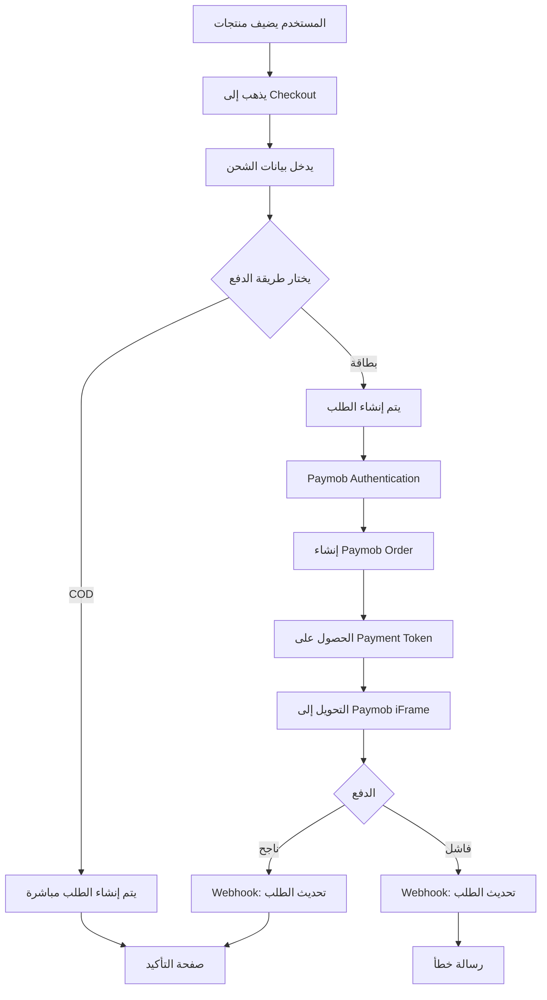

# 💳 Paymob Integration - Quick Start

تم إضافة تكامل Paymob بنجاح إلى المشروع! هذا الدليل السريع يساعدك على البدء.

## ✅ ما تم إضافته

- ✅ بيانات Paymob Test API في `.env.local`
- ✅ تكامل كامل مع Paymob API
- ✅ دعم بطاقات الائتمان/الخصم
- ✅ دعم المحافظ الإلكترونية
- ✅ دعم الدفع عند الاستلام (COD)
- ✅ معالجة Webhooks
- ✅ HMAC Verification للأمان

## 🚀 البدء السريع

### 1. تشغيل المشروع

```bash
npm run dev
```

### 2. اختبار الدفع

1. افتح `http://localhost:3000`
2. أضف منتج إلى السلة
3. اذهب إلى `/checkout`
4. أدخل بيانات الشحن
5. اختر **Credit/Debit Card**
6. استخدم بطاقة الاختبار:
   ```
   Card Number: 4987654321098769
   CVV: 123
   Expiry Date: 12/25
   ```

## 📚 الملفات الهامة

| الملف | الوصف |
|------|-------|
| [`PAYMOB_SETUP.md`](./PAYMOB_SETUP.md) | دليل الإعداد الكامل |
| [`PAYMOB_TESTING.md`](./PAYMOB_TESTING.md) | دليل الاختبار والأمثلة |
| [`.env.local`](./.env.local) | بيانات Test API |

## 🔑 بيانات الاختبار الحالية

البيانات الموجودة في `.env.local` هي بيانات اختبار عامة من Paymob. للحصول على أفضل تجربة:

1. سجل حساب في [Paymob Portal](https://accept.paymob.com/portal2/en/register)
2. احصل على بياناتك الخاصة من **Settings** → **Account Info**
3. استبدل البيانات في `.env.local`

## 💳 بطاقات الاختبار

### ✅ بطاقات ناجحة

| رقم البطاقة | CVV | تاريخ الانتهاء |
|-------------|-----|----------------|
| `4987654321098769` | `123` | أي تاريخ مستقبلي |
| `5123456789012346` | `123` | أي تاريخ مستقبلي |

### ❌ بطاقات فاشلة

| رقم البطاقة | CVV | تاريخ الانتهاء |
|-------------|-----|----------------|
| `4000000000000002` | `123` | أي تاريخ مستقبلي |

## 🔄 Flow الدفع



## 🛠️ الملفات التقنية

### Backend API Routes

- **`/api/checkout`** - إنشاء الطلب وتهيئة الدفع
- **`/api/webhooks/paymob`** - استقبال إشعارات Paymob

### Paymob Library

- **`src/lib/paymob/client.ts`** - التكامل مع Paymob API
- **`src/lib/paymob/webhook.ts`** - معالجة Webhooks
- **`src/lib/paymob/types.ts`** - TypeScript Types

### Frontend Components

- **`src/app/(storefront)/checkout/page.tsx`** - صفحة الدفع
- **`src/components/storefront/checkout/CheckoutForm.tsx`** - نموذج الشحن

## 🔐 الأمان

- ✅ HMAC Verification لجميع Webhooks
- ✅ Server-side validation لجميع البيانات
- ✅ Environment variables للبيانات الحساسة
- ✅ Idempotency للـ Webhooks

## 📊 مراقبة الطلبات

### في قاعدة البيانات

```sql
-- عرض آخر الطلبات
SELECT 
  order_number,
  status,
  payment_status,
  payment_method,
  total,
  created_at
FROM orders
ORDER BY created_at DESC
LIMIT 10;
```

### في Paymob Portal

1. اذهب إلى [Transactions](https://accept.paymob.com/portal2/en/transactions)
2. راجع جميع المعاملات
3. تحقق من التفاصيل والحالة

## 🐛 استكشاف الأخطاء

### مشكلة: "Failed to authenticate with Paymob"

```bash
# تحقق من PAYMOB_API_KEY في .env.local
cat .env.local | grep PAYMOB_API_KEY
```

### مشكلة: "Invalid integration ID"

```bash
# تحقق من PAYMOB_INTEGRATION_ID في .env.local
cat .env.local | grep PAYMOB_INTEGRATION_ID
```

### مشكلة: "Webhook not received"

1. استخدم ngrok للاختبار المحلي
2. تحقق من Webhook URL في Paymob Portal
3. راجع HMAC Secret

## 📞 الحصول على المساعدة

- 📖 [دليل الإعداد الكامل](./PAYMOB_SETUP.md)
- 🧪 [دليل الاختبار](./PAYMOB_TESTING.md)
- 🌐 [Paymob Documentation](https://docs.paymob.com/)
- 💬 [Paymob Support](https://accept.paymob.com/portal2/en/support)

## 🚀 الانتقال للإنتاج

عند الاستعداد للإطلاق:

1. ✅ أكمل KYC في Paymob Portal
2. ✅ احصل على Live API credentials
3. ✅ حدث `.env.production` ببيانات الإنتاج
4. ✅ حدث Webhook URL في Portal
5. ✅ اختبر على staging environment
6. ✅ راقب أول 10 معاملات بعناية

---

## 📝 ملاحظات هامة

> **⚠️ تحذير:** البيانات الحالية هي بيانات اختبار. لا تستخدمها في الإنتاج!

> **💡 نصيحة:** احتفظ ببيانات الاختبار والإنتاج في ملفات منفصلة (`.env.local` و `.env.production`)

> **🔒 أمان:** لا تشارك API Keys أو HMAC Secrets مع أحد

---

**تم الإعداد بنجاح! 🎉**

الآن يمكنك البدء في اختبار الدفع. راجع [`PAYMOB_TESTING.md`](./PAYMOB_TESTING.md) لمزيد من الأمثلة.
